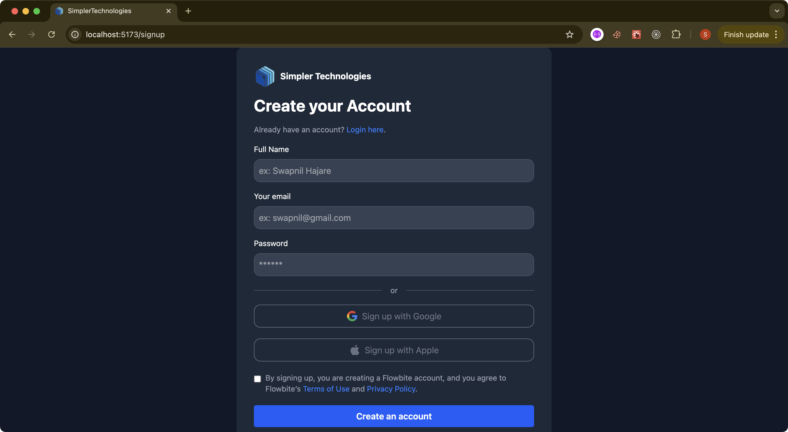
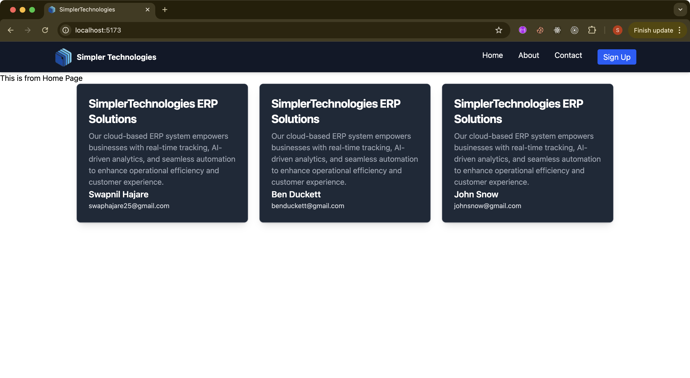

# 🚀 Responsive React UI Assignment

A simple, responsive React application built with Vite and styled using Tailwind CSS.  
This project demonstrates clean UI design and React component structure across three core tasks.

---

## 🛠 Tech Stack

- ⚛️ React (via Vite)
- 🎨 Tailwind CSS
- 🌐 React Router

---

## 📦 Features

### 🔹 Task 1: Sign-Up Page
- Fully styled sign-up form with:
  - Full Name
  - Email
  - Password
- OAuth-style login buttons (Google, Apple)

### 🔹 Task 2: Responsive Navigation Bar
- Clean top navigation
- Responsive hamburger menu on mobile
- Links: Home, About, Contact, Sign Up

### 🔹 Task 3: `<UserCard />` Component
- Reusable component that accepts `name` and `email` as props
- Card-style layout with dark theme styling

---

## 📷 Screenshots

### 🖼️ Sign-Up Page

### 🖼️ Navbar (Desktop and Mobile) and UserCard Component

---

## 📬 Contact

For any questions, reach out at hajareswapnil.2502@gmail.com

Made by Swapnil Hajare